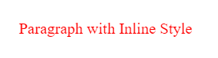
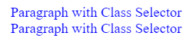
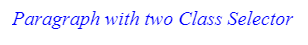
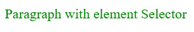
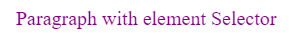

In this tutorial we will learn about CSS specificity, what is it, why is important, and how it works in our HTML.

## Targeting an HTML element

When designing a web page we use CSS to target elements on the page and applying styles to them. These properties in CSS are called **Selectors**. There are a few ways of targeting an HTML element.

But what happened when we have a few selectors targeting the same element?

Example:

```markup
<p>
 What color is this paragraph?
</p>
```

```css
#myid { color: red }
.green { color: green}
p { color: orange }
```

In the example above we see both selectors are targeting the same element. So what do you think will be chosen for the element?

## What is CSS Specificity

This is where specify comes in. Specificity means the more specific the selector the more priority it gets.

The more specific the CSS is, the more it will take priority and override the less specific CSS.

The following are the types of selectors to target an HTML element in their importance order:

1. Inline Style
2. ID Selector
3. Class Selector
4. Element Selector
5. Universal Selector

## Inline Style

Inline style is not a CSS selector in that you don't have it in its own CSS file, rather it's an attribute you put directly on an HTML element:

Example:

```markup
<p style="color: red">Paragraph with Inline Style</p>
```

Outputs:



In terms of specificity Inline style is the most direct and specific way of targeting and changing the style of an element.

## ID Selector

The next Selector priority after the Inline style is the ID selector. ID selector targets an element by its ID.

In HTML you can assign an element with a unique ID using the id property. CSS then scans the DOM from top to bottom and takes the first element with that ID. There can only be one element targeted with the ID.

Usually, you should use the Class selector instead of the ID, but if you know you will only have one element with this style, or you will be targeting the element with JavaScript code then it's fine to use the ID selector.

In HTML the assignment would look like this:

```markup
<p id="pid">Paragraph with ID Selector Style</p>
```

```css
.pid {
 color: orange
}
```


## Class Selector

Class Selector is considered less specific than ID. The class is represented in the DOM by adding a class name to the element.

Classes can be reused on multiple elements who have the class.

```markup
<p class="blue">Paragraph with Class Selector</p>
<p class="blue">Paragraph with Class Selector</p>
```

```css
.blue{
 color: blue
}
```



You can also add several classes on the same element

```markup
<p class="blue bold">Paragraph with two Class Selector</p>
```

```css
.blue{ color: blue}
.italic{ font-style: italic; }
```



## Element Selector

The Element Selector targets an element by its tag type.

For example to target all paragraphs

```markup
<p>Paragraph with element Selector</p>
```

```css
p { color: green }
```



## Universal Selector

The universal selector is considered to be the least specific selector and therefore any of the selectors above that applies to one of the universal selector elements will override this selector.

```markup
<p>Paragraph with Universal Selector</p>
```

```css
* { color: purple }
```



## Notation

When calculating what takes priority it is common to use a numbering notation that describes the exact amount of specificity the selector has, or its specificity "value".

We can number each of our selectors with the following notation.:

- Inline Style: (1,0,0,0)
- ID Selector: (0,1,0,0)
- Class Selector: (0,0,1,0)
- Element Selector: (0,0,0,1)
- Universal Selector: (0,0,0,0)
- (Important): (1,0,0,0,0)

So For every selector, we add up its specificity and the one that has a higher value will be selected for the styling of the element.

So if we go back to our starting example:

```markup
<p>
 What color is this paragraph?
</p>
```

```css
#myid { color: red }
.green { color: green}
p { color: orange }
```

We calculate

#myid = (0,1,0,0)

.green = (0,0,1,0)

p = (0,0,0,1)

Therefore the myid selector will be selected and the color of the paragraph will be red.

## Same level

What happens when we have two selectors with the same specificity?

Then the selector that is lower in the file takes priority for example

## Conclusion

In this tutorial we learned about the CSS specificity and how to calculate it.

For more in-depth details and examples check out [specifics-on-css-specificity](https://css-tricks.com/specifics-on-css-specificity/) on css-trick.com.

Thanks for reading.

See you in the next tutorial.
