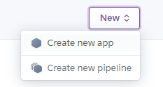
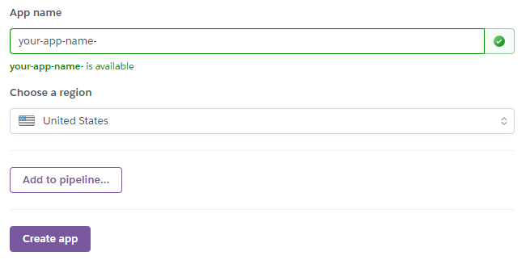
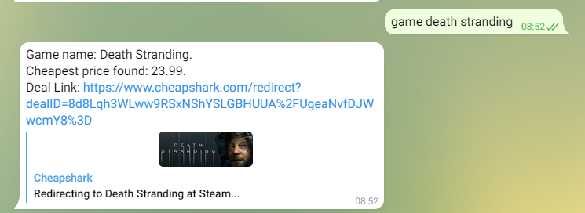

Welcome to my Node JS Telegram bot Heroku tutorial.

In this tutorial we will learn how to run Telegram bot on Heroku with Node.js and upload it to a Heroku server.

To learn more about how I created the bot check out me previous post [How to make a Telegram Bot in Node.js](https://thinkcodeplay.com/how-to-make-a-telegram-bot-in-node-js/?preview_id=2280&preview_nonce=d694481ab1&preview=true&_thumbnail_id=2292).

I also created a tutorial [How to build a Node.js and Express app](https://thinkcodeplay.com/how-to-build-a-node-js-and-express-app/), check it out for more details about [express](https://expressjs.com/).

Complete Source code can be found on my [GitHub repo](https://github.com/ThinkCodePlay/telegram-express-server), and you can try out the bot at @thinkcodeplay\_gamedeal\_bot

## Setup

Lets start by initializing a new app and installing our dependencies first:

```bash
npm init -y
npm i axios
npm i express
npm i nodemon --save-dev
npm i env-cmd --save-dev
```

We wont be needing any telegram node libraries since we will be directly interacting with the telegrams API.

In the root we will create a new **app.js** file and insert a basic server with express:

```javascript
const express = require('express');
const port = process.env.PORT || 3000;

const app = express();
app.use(express.json());

app.get('/bot', function (req, res) {
  res.send('Hello World');
})
 
app.listen(port, () => {
    console.log('Server is up on port ' + port);
})
```

and we will create our development script:

```json
  "scripts": {
    "start": "node app.js",
    "dev": "env-cmd -f .env nodemon app.js"
  }
```

env-cmd is used to get our environment variables which will be stored on the server. make sure to create a **.env** in the root directory and to add it to **.gitignore**.

Now you can run the app with npm run dev.

## Fetching Game Deals

For fetching our deals we will use our code we used in the previous post [How to make a Telegram Bot in Node.js](https://thinkcodeplay.com/how-to-make-a-telegram-bot-in-node-js/?preview_id=2280&preview_nonce=d694481ab1&preview=true&_thumbnail_id=2292) and put it in the utils folder

```javascript
const axios = require("axios").default;

const gameDeal = async (gameName) => {
  try {
    const response = await axios.get(
      `https://www.cheapshark.com/api/1.0/games?title=${gameName}`
    );

    if (response.data.length > 0) {
      console.log(response.data[0]);
      const gameData = `Game name: ${response.data[0].external}. \nCheapest price found: ${response.data[0].cheapest}. \nDeal Link: https://www.cheapshark.com/redirect?dealID=${response.data[0].cheapestDealID}`;
      return gameData;
    } else {
      return "no deals found";
    }
  } catch (error) {
    return "Sorry, got an error";
  }
};

module.exports = {
  gameDeal,
};
```

And pull it into our **app.js** file.

```javascript
const { gameDeal } = require("./utils/cheapshark");
```

## Creating the bots route

It's time to create the route that our bot will send data to. In [telegrams bot documentation](https://core.telegram.org/bots/api#available-types) you can find the data structure that is being sent. We need the chat data in order to get the message and the id of the message so we can reply with the response.

The format we are going to expect to get is 'game <game title>'. If any other format or string is entered we will let the user know.

Then we go to the function we created to fetch the data and send it back when it is done.

```javascript
app.post("/bot", async (req, res) => {
  try {
    const chat_id = req.body.message.chat.id;
    const text = req.body.message.text;
    const first_name = req.body.message.from.first_name;

    const words = text.split(" ");
    const firstWord = words.shift();
    const gameName = words.join(" ");

    switch (firstWord) {
      case "game":
        const deal = await gameDeal(gameName);
        return sendText(
          res,
          chat_id,
          deal
        );
        break;

      default:
        return sendText(
          res,
          chat_id,
          `Hi ${first_name}, to find a game deal type 'game' as a first word followed by the game title: \ngame <game title>`
        );
        break;
    }
  } catch (error) {
    return res.status(502).send({ error, req, res });
  }
});

function sendText(res, chat_id, text) {
  console.log("send text", res, chat_id, text);
  return res.status(200).send({
    method: "sendMessage",
    chat_id,
    text,
  });
}
```

## Upload the app to Heroku

Heroku is a cloud platform that we can upload out node.js app to. It has a free tier that we can use to try out app. First create a user on heroku.com. Once you are done with signup we will create a new app:



Then insert an app name:



To upload our code we will use the Heroku CLI which can be found [here](https://devcenter.heroku.com/articles/heroku-cli).

Once installed you can log into your account from the command line with

```bash
heroku login
```

and then set up the remote server to push to Heroku.

```bash
cd telegram-express-server
git init 
heroku git:remote -a your-app-name
```

Change the remote to your app name.

We can now deploy our app to the cloud.

```bash
git add . 
git commit -am "first commit" 
git push heroku master
```

## Webhook Setup

In order for our bot to send requests to the server on Heroku we need to set up a webhook which will send a post request to the route we wrote. Read [Marvin's Marvellous Guide to All Things Webhook](https://core.telegram.org/bots/webhooks) for more info on telegrams webhooks.

for that we can use the browser to set up the webhook with a get request url:

```bash
https://api.telegram.org/bot<TELEGRAM_BOT_TOKEN>/setWebhook?url=https://<your-app-name>.herokuapp.com/bot
```

Replace **<TELEGRAM\_BOT\_TOKEN>** with the secret token you got from BotFather and **<**your-app-name**\>** with the name of your app.

If all went well you should get back a response:

```json
{
    "ok": true,
    "result": true,
    "description": "Webhook was set"
}
```

Time to test your app:

enter 'game' followd by the game title you are searching for:



Congratulations! You now created your bot and it is served correctly on a remote server.

## Conclusion

In this tutorial we learned how to create an express server and host it on Heroku. We also create a webhook to send data from a telegram bot we created to express server we created.

Hope you enjoyed this tutorial!
