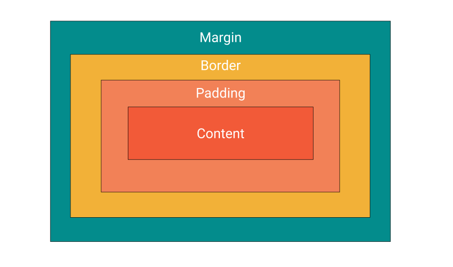

In this tutorial, we will learn about the box model, what is it and how it works.

## What is the box model?

Every element in the HTML document has properties that define its size and position in the document flow. What are these properties and how do they affect the element they are in?

## Box model components

An HTML element is built from 4 key components: Content, Padding, Border, and Margin. Below is an image of the box model structure.



Structure of the box model

- Content - The content is, as you might excpect, the content of the element. It could be the text, image or video depending on the element being used.
- Padding - Padding is the area araound the content, and is used to add spacing between the content and the border.
- Border - Border is the area that around the content and padding.
- Margin - Margin is around border and its purpose is to create space between the element and other elements on the DOM.

Let's see what properties affect which part of the box model.

### Content

The **Content** box is where the content of the HTML tag is displayed. The sizing of the box is affected by the size of the content.

You can change the height and width of the content using the following CSS properties:

- [`width`](https://developer.mozilla.org/en-US/docs/Web/CSS/width)
- [`min-width`](https://developer.mozilla.org/en-US/docs/Web/CSS/min-width)
- [`max-width`](https://developer.mozilla.org/en-US/docs/Web/CSS/max-width)
- [`height`](https://developer.mozilla.org/en-US/docs/Web/CSS/height)
- [`min-height`](https://developer.mozilla.org/en-US/docs/Web/CSS/min-height)
- [`max-height`](https://developer.mozilla.org/en-US/docs/Web/CSS/max-height)

### Padding

The **padding area** is outside the content area and it gives space between the content. The padding can be changed by the following properties.

- [`padding-top`](https://developer.mozilla.org/en-US/docs/Web/CSS/padding-top)
- [`padding-right`](https://developer.mozilla.org/en-US/docs/Web/CSS/padding-right), 
- [`padding-bottom`](https://developer.mozilla.org/en-US/docs/Web/CSS/padding-bottom),
-  [`padding-left`](https://developer.mozilla.org/en-US/docs/Web/CSS/padding-left)
-  [`padding`](https://developer.mozilla.org/en-US/docs/Web/CSS/padding) shorthand properties.

### Border

The **border area** is an area to display the border of the content (+padding) area.

You can determine its size and thickness using the following CSS properties:

-  [`border-width`](https://developer.mozilla.org/en-US/docs/Web/CSS/border-width)
-  [`width`](https://developer.mozilla.org/en-US/docs/Web/CSS/width),
- [`min-width`](https://developer.mozilla.org/en-US/docs/Web/CSS/min-width)
- [`max-width`](https://developer.mozilla.org/en-US/docs/Web/CSS/max-width)
- [`height`](https://developer.mozilla.org/en-US/docs/Web/CSS/height)
- [`min-height`](https://developer.mozilla.org/en-US/docs/Web/CSS/min-height)
- [`max-height`](https://developer.mozilla.org/en-US/docs/Web/CSS/max-height)
- [`border`](https://developer.mozilla.org/en-US/docs/Web/CSS/border) shorthand properties

### Margin

The **margin area** is the area that extends the entire HTML element, and what defines the spacing between its own box with its neighbor HTML elements.

Properties that define the margin:

- [`margin-top`](https://developer.mozilla.org/en-US/docs/Web/CSS/margin-top)
- [`margin-right`](https://developer.mozilla.org/en-US/docs/Web/CSS/margin-right)
- [`margin-bottom`](https://developer.mozilla.org/en-US/docs/Web/CSS/margin-bottom)
- [`margin-left`](https://developer.mozilla.org/en-US/docs/Web/CSS/margin-left)
- [`margin`](https://developer.mozilla.org/en-US/docs/Web/CSS/margin) shorthand properties

### margin collapsing

Somtiems you may have cases where the margins of two elements overlap. This is known as Margin collapse.

This can happen when an element above an element below it share the same space of the margin.

For example, if an element has a margin of 100px bottom, and the element below has 50px top, you would expect that the distance between the two would be 150px but it doesn't. Instead, they share the same space and thus take the bigger of the two which would be 100px.

## CSS shorthand

instead of typing in every single property separately you can use shorthand properties.

here are the shorthand properties for the box model:

### padding

```css
padding: 25px; // sets all four margins to 25px
padding: 25px 50px; // sets top and bottom margins to 25px, and right and left to 50px
padding: 25px 50px 75px 100px; // sets margin by order top,right,bottom,left
```

### border

```css
border: 5px solid red; // sets the width to 5px, the style to solid and the color red
```

### margin

```css
margin: 25px; // sets all four margins to 25px
margin: 25px 50px; // sets top and bottom margins to 25px, and right and left to 50px
margin: 25px 50px 75px 100px; // sets margin by order top,right,bottom,left
```

## Calculating box size

So how is the box size calaulated?

By default the box is calculate by the the content of the box. So if the box was set to 100px and any border is added, the size of the box will be greater than 100px.

This is define by the css property box-sizing

```css
box-sizing: content-box;
```

What you normaly would expect is when you give an element a size it would include the border as well. Tha'ts why you should normaly set the box to border-box. Now when you give you element a size it will shrink the content and border to fit 100px.

```css
box-sizing: border-box;
```

## Using the Developer Tools

You can see what the box model is like in an element by inspecting the box in your developer tools. Right click inspect on the element and when you scroll down in the styles tab you can find the following box model image describing the box model we just learnd in this post

## Summery

In this post we learnd about the box model and how it effects the sizing of the elements in the DOM

Hope you enjoyed this one!
