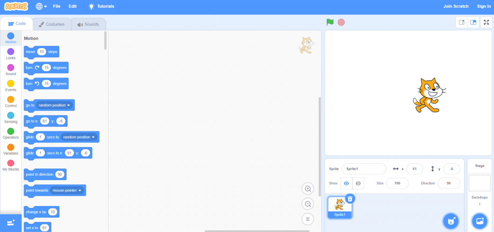
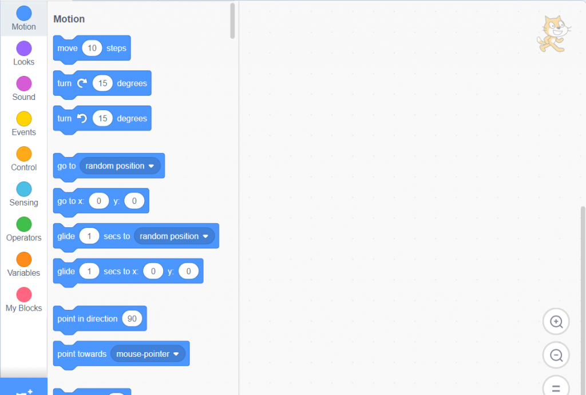
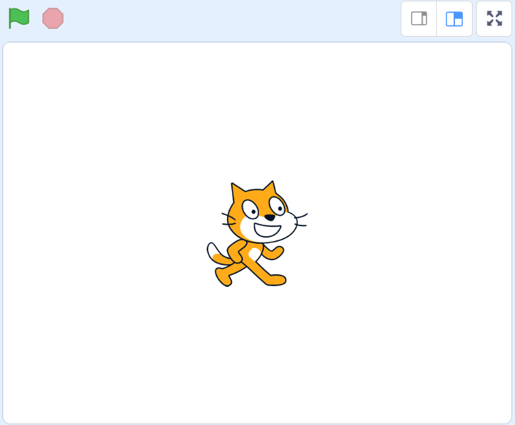
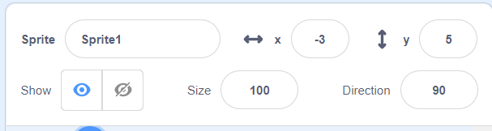
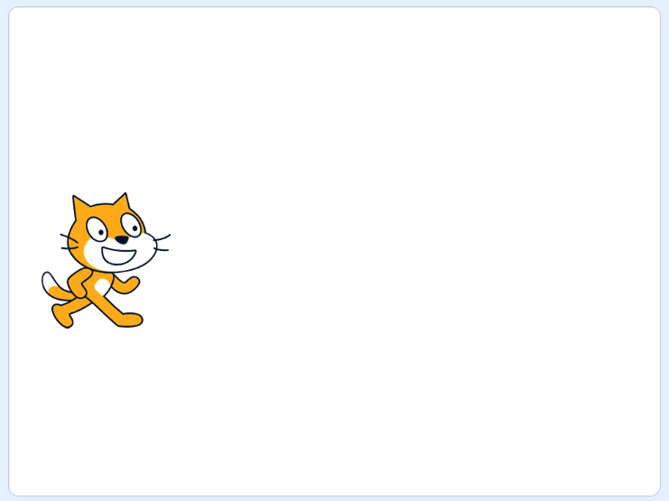
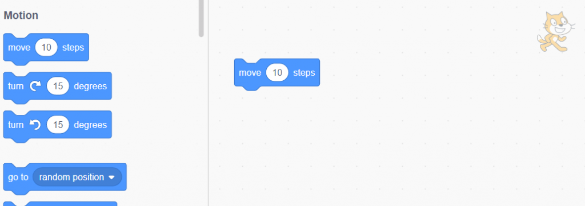

## What Is Scratch?

This is the first post on Scratch Tutorial For Complete Beginners. no previous coding knowledge is required.

Scratch is a free coding environment for kids to create and learn to code. It uses a simple drag and drop interface with all features built in to create stories, games and animations.

## Let's Get To Know Scratch

First let's get to know the scratch environment.

Go to the [Scratch web site](https://scratch.mit.edu/) and click Create to start a new project.

We can divide this screen into 3 main sections.

1. Coding area
2. The Game Area
3. The Details area

### Coding Area

On The left side you will find the code area.

This is where we will be building our coding blocks, and all the game logic.

On the top right you can see which character we are currently focusing on.

1. Here is a list of all the code block we can use.
2. This is coding area. We drag the block we want from the block area into the coding area.
3. The image shows us what character we are currently working on

### The Game Area

To the right is the game area. This is where we can see the result of the code we will be creating.

In the center we can see the image of the cat. This is the player currently displayed on screen. any character in screen is know as a "Costume". In just a few minutes we will be moving this character.

On the top left you can see a green flag and a red stop sign. These are our stop and start buttons for running and stopping our code from running. We will get to this later when we start building some code.

### The Details Area

On the bottom right we have details about our currently selected character on screen. this displayed the following details

1. what sprite is being used now
2. x and y coordinates.
3. is the character show or not
4. the size of the character
5. direction

That's enough details for us to start. We will see more options when we will get to them in later sections.

## Moving Our Character

Let's move our friend the cat. You can grab him with your mouse and choose where to place him.

notice that when you move the cat, the values of X and Y change as well.

Place the cat to left side of the screen.

Now we will move the cat with some code.

Drag the move 10 steps block to coding area. Now if you click on that block in the coding area you will see the cat will take 10 steps to the right. Also notice that the cat's x value changes by 10 every time you click.

This brings us to our first concept of what code is. Code is an instruction that tell the computer what to do. in this case our code told the character to add 10 to it's x value.

## Summery

In this chapter we learned about Scratch environment.

We have the Coding area, the game area, and the details panel. and We started with a little bit of code to move our character on the screen.

In the next chapter we will learn about coordinates, the concept of code flow, and the game loop.
