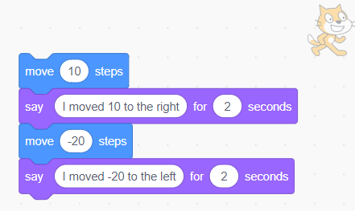
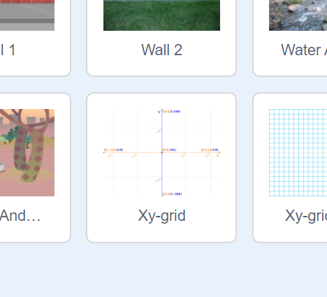
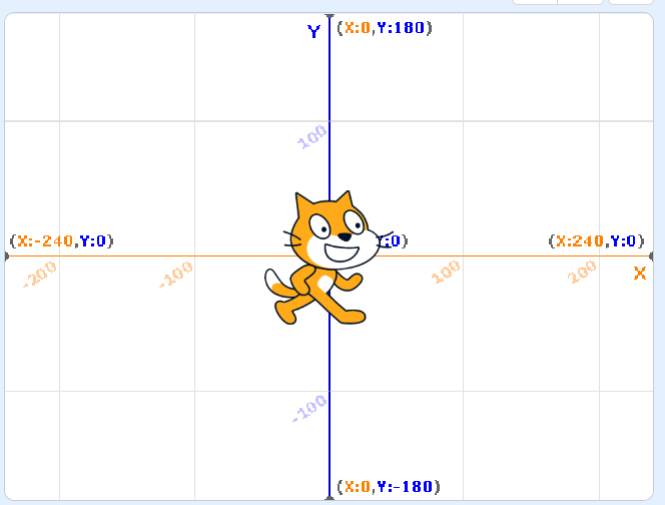
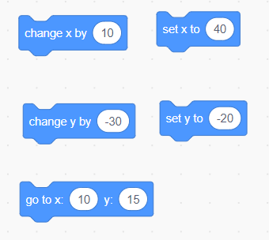
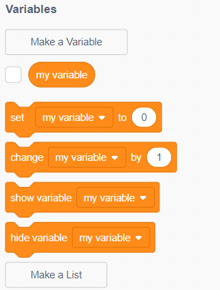
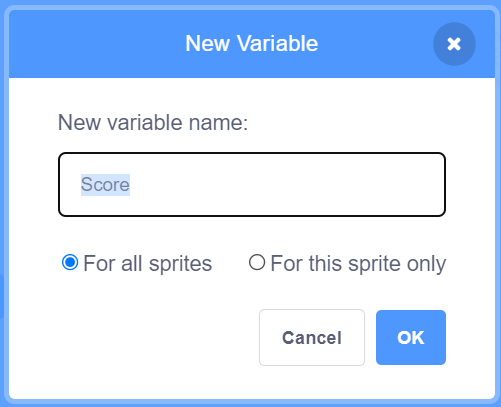
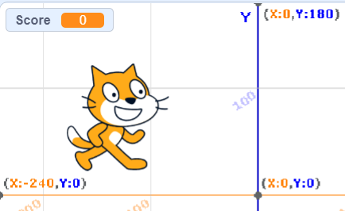
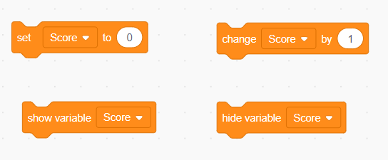

This is part 2 of the Scratch Tutorial For Complete Beginners. In [the last tutorial](/posts/scratch-tutorial-for-complete-beginners-pt-01/) we got to know the scratch environment, and got to know the basics of how to start working with scratch. In this Scratch tutorial we're going to learn about variables and coordinates.

## Flow Control

Let's first start with a little example and then we will explain what we just did.

Open up [a Scratch project](https://scratch.mit.edu/projects/editor) and look for the following code blocks and drag them to the coding area.

Change the text in the "Say" circle and change it to I moved 10 to the right, and I moved -20 to the left.

Now click on the block once to see how the code effects the play area.

You will see the character moving 10 steps to the right. Then the cat will say "I moved 10 to the right" and wait for 2 seconds. Then the cat will move to the left by -20 steps, and say "I moved to -20 to the left"

As you can see the code you wrote went instruction by instruction from top to bottom. This brings us to a very important rule in coding. Code goes down by order, instruction by instruction, one after the other. So the order of where you put your code block is very important. Try playing around with the order of the code blocks and see how it effects the game.

So we used in this example the "move 10 steps" block, but what steps are we talking about?

This brings us to our next topic: Variables.

## What are Variables?

You may have noticed in our previous example that when we clicked the code block to run the commands, the X value in the details area changed.

gif of x moving

X represents a location of the character in the play area. The higher the X value, the more the character will move to the right. The lower the value, the more the character will move to the left.

A value the can be used in code is know as a "Variable".

Variables are just pieces of information that we can use.

In this example, the variables name is called X, and it hold a number as information.

When we used the block "move 10 steps", we were actually telling the computer to add 10 to our x variable.

So a variable is a piece of information that has a name, and has value. In computer terms this know as Key and Value, the key represents the name we use for that piece of information.

So we now know that a Variables has a name, and it hold information. But how does the game know where our to put our character on the screen?

This brings us to coordinates.

## What are Coordinates?

coordinates are numbers the represent a point in some space. It's like saying what you address is.

As we learned the higher value we give the X variable, the more the character will move to the right.

try moving the character with your mouse in the play area and see how it effects the X and Y values in the details area.

As you can see moving to the right make the X go up, and moving to the left makes the X value go down. Moving the character up makes the Y value higher and moving down lowers the Y value.

So how do we determine what value does the x and y get? We can see this better by seeing a map of how our game area is set.

Let's add a map to our play area.

Under the game area you will find a Stage area. Here we can choose what background to use for our game. press the choose a backdrop button and select the magnifing glass to find a background.

Scroll until you find the xy-grid

Now you will see that our game area has the following background:

Let's explain what this background means.

In the center of the Plat area we see the spot where both lines (vertical and horizontal) collide.

This is the center of the play area. We can see that in the background image this place has a (X:0,Y:0) text above it. This simply explains to us that at this intersection the value of X is 0, and the value of Y is 0.

If you follow the horizontal line to the right you will see that it shows (X:240,Y:0) and to the left (X:-240,Y:0). On the Vertical line we can see (X:0,Y:180) and (X:0,Y:-180) on the top and bottom.

So now we can visually see what we explained above.

In the center of the play area, this is where the x and y start at 0. moving right and left will change the X value, and moving up and down will change the Y value.

Starting from the center of the play area, we can go a maximum of 240 units to the right and 240 to the left. This give us a total of 480 units from the loft border to the right border.

The same goes for the height. Starting from the center we can go up 180 units and down 180 units giving us a total of 360 units from the top border to the bottom.

Try moving the character around and see how it effects the X and Y values.

As you can see, by moving the character on screen we changed its X and Y variables and the characters coordinates.

So now that we know about variables and coordinates, how can we changes these values using code?

## How to change variables?

Because the character coordinates are used often when making games, Scratch gives us several functions that are easy to use in order to change the X and Y values.

On the left panel we can see that code blocks are split into sections:

In the **motion** section we will find lots of block that can easily help moving our character.

Here are some example you should try to use now. Drag the following block into the coding area and change some of their values. Click on the block to see how it effects the character.

- Set x to 40: changes the x value to 40
- set y to -20: changes the y value to -20
- got to x: 10 y: 15 : changes the x and y value to (X:10,Y:15)
- change x value by 10: adds to the current x value by 10.
- change y value by -30: subtracts the the current value of y by 30.

The X and Y values always exists when placing a character in our game, because the character must have a defined place on the screen.

But we can also create our own variables.

## Creating new variables

Let's first start with the question why would we need to create new variables?

Let's say we want to count the score of the game, or we want to see how many lives we have left in the game, we would need some place to save and remember what the score is.

That's where variables are useful. We can create a new variable, define what value it will have, and how it will change. Just like we saw happened with the x and y variables.

To create a new variable scroll all the way to the bottom of the code block to the **Variables** section:

Now select **Make a Variable**, and create a new variable with the name Score and press OK (keep "For all sprites" selected).

We can now see that we have a new Score variable in our code block and that it is displayed in the play area.

Now we can change the value of our score variable using the following code blocks:

- Set score to 0: changes the score variable to 0
- change score by 1: adds 1 to the score variable
- show/hide variable: Shows or Hides the score variable from the play area.

Try playing around with different values and see how they effect the score value.

## Summary

In this chapter we learned about the meaning of flow control and that each instruction runs once and then goes to the next instruction.

We also learned about variables and coordinates and how we can change them using code.

Finally we learned how to create new variables and how to change them.

Hope you enjoyed this tutorial!
