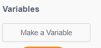
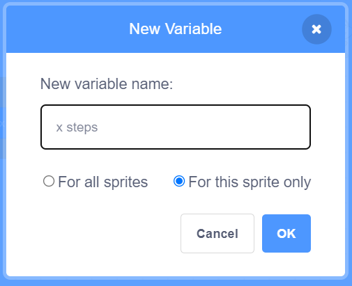
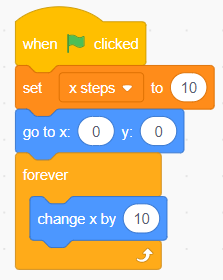
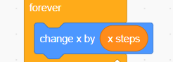
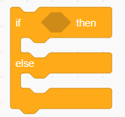
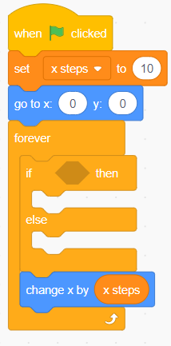
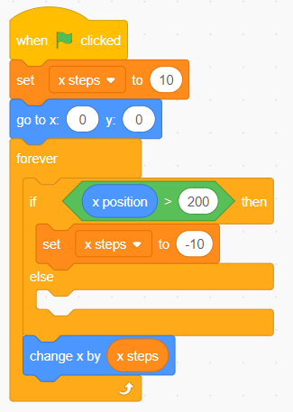
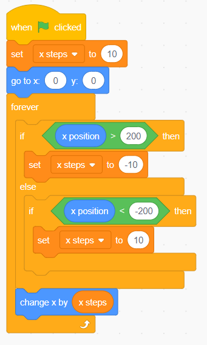

This is part 4 of the Scratch Tutorial For Complete Beginners. In the [previous chapter](https://thinkcodeplay.com/scratch-tutorial-part-3-the-game-loop/) we learned about loops and how to use them. In this Scratch tutorial We will learn our final piece we need to create some awesome games, If statements and operators! LETS GOOOO!!

## What are If statments?

Let's start with the following example:

In the variables section create a new variable and call it "x steps", selcet the "For this sprite only" option and click ok. This will create a next step variable we can use.

Create the following code in the coding area:

Now to use the variable we set up, drag the variable "x steps" into the "change x by" block and replace the 10 value with the "x steps variable".

We now have an endless loop that starts with the (X:0,Y:0) position, sets how many steps x will move and the we use it in the forever loop to move our character constantly to the right.

What if we want to make the character to move left once it hit the right side of the screen?

To do this we would constantly need to ask- did I reach the right border? If I did - Move to the left. If not - continue moving to the right. On the next loop check again- did I reach the right border? If I did, move left if not continue right.

This Is what is known as an If Else Statement.

If X is True - do somethin. Else - do something else.

Let's do this now.

Search for the If Else block and drag it to the coding area like this:

So now that we have our If Else Statement in place, how do we check if the x coordinate of our character reached the right or left border? This is where we need operators.

What Are Operators?

Operators are a computers way to compute or check one value against another.

For example you can check if one variable is bigger than another variable, or you can add values together

Here are some other operator examples:

- A is greater then B.
- A is smaller then B
- A is equal to B
- A + B
- A - B

In our case we need to check if X has reached a point to the right we want it to stop and move to the left

Let's use the greater then operator. For this we have the "X > Y" block. Insert the x position variable into the first slot of the greater then operator, and type 200 for the second slot. Then add the set x steps to -10 into the if statement.

Hit the green light button start the game and see what happens!

As you can see once the characters x value passed 200, we set the direction to move -10 every loop, making the chatacter move all the way to the left border.

Here's a challenge for you- how can we make the character move right after it reached -200?

The solution should be similar to what we already did. but in this case we don't need the ELSE statement-

Great job! Now our character moves right and left across our game in an endless loop!

## Summery

In this chapter we learned all about If statements and about using operators.

Hope you enjoyed this one

See you in the next tutorial!
