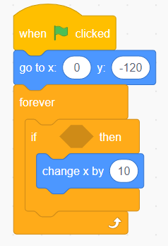
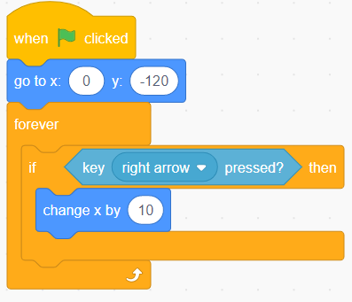
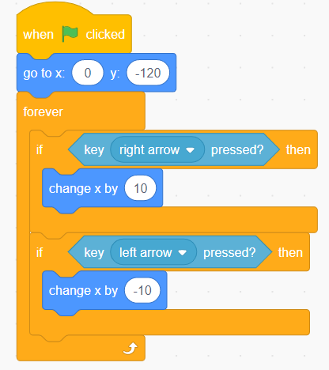
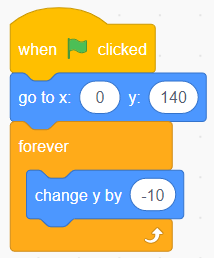
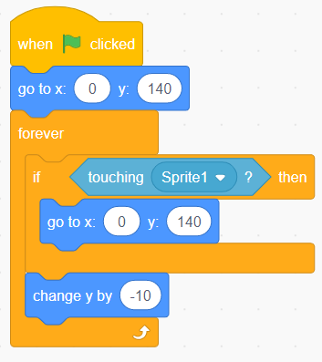
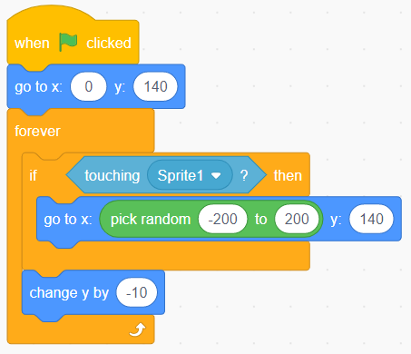

In this Scratch Tutorial For Complete Beginners we will learn about how to take user input to move our character. This will be based on our [previous example](https://thinkcodeplay.com/scratch-tutorial-for-complete-beginners-part4/) where we learned about operators and if statements so be sure to check it out if you missed it.

## What is user input?

In the last tutorial we created a game where the character moves across the screen in a never ending loop.

This is a great start but we want to be able to control our player with the arrow keys.

Let's start with a basic example first. Create the following code:

So we setup the initial x,y coordinates and we will move X 10 steps to the right if the condition is true. But what condition do we need? That's where we use the sensing group of code.

Drag in the Key Pressed cod into the if statment and change it from Space to Right arrow:

Hit the go button and see how the player moves when you press the right arrow.

To move the player to the left we need duplicate the if statement, but we need to change the arrow to left and change x to move -10 steps.

## Catching Apples

Now that we can move our player let's give him something to play with. We will create an apple that will drop from the top of the screen for him to catch.

In the bottom panel select choose a sprite:

And search for apple (you can use any other sprite you want).

A sprite is a new character we can interact with. Each sprite has it's own code section and has no knowledge of the other sprites code.

Create the following code for the apple:

When you hit the Go button you will see the apple fall from the top of the screen.

Now how can we make the player know when he caught the apple?

We will use for this an if statement and check if the player is touching the apple.

Create the following code:

This will make the apple go back to the top of the screen when it touches the player.

If you want to make the apple start from a different point we can make it move to a random place doing the following code:

## Summary

In this tutorial we learned how to get user input to move the player and how to make the player detect if it touched another sprite.

In the next tutorial we will add all the finishing touches to create a complete game.
