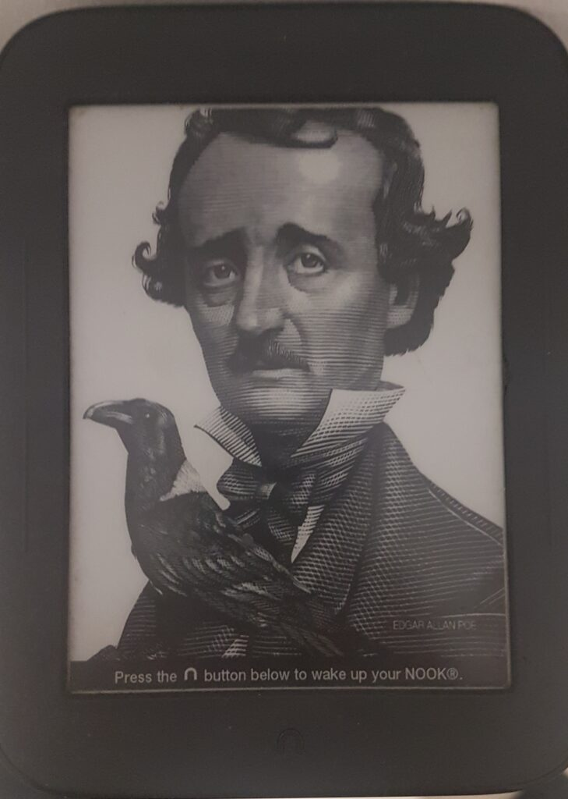

In this tutorial I will show you how I created a Node JS Image Generator.

I recently stumbled upon an old eBook reader from Barnes and Noble called “[Nook](https://en.m.wikipedia.org/wiki/Barnes_%26_Noble_Nook)” that has been laying around for years and I thought about the default image. (later I realized that they have other better looking ones).



But as much as they say “you can’t judge a book by its cover”, the cover does have to make you at least a little inspired to make you read the book.

After a little bit of research I found you can create your own screen saver on the nook in a screen saver folder, the only requirement being that the file has to be 600 x 800 size. I thought why not create some better looking images to make us want to read!

My goal here was to make a program that will create images with an interesting quote above the image.

## The Setup

I looked for an npm package that will be able to create an image from a custom HTML that I will build. Eventually I decided on using [node-html-to-image](https://www.npmjs.com/package/node-html-to-image) for its simplicity and its ability to create dynamic content. It uses [puppeteer](https://github.com/puppeteer/puppeteer) to create a headless browser to load the html and [handlebars](https://handlebarsjs.com/) for creating the dynamic content.

load the package to the project with

```powershell
npm i node-html-to-image
```

## Creating the html

I wanted to be able to see changes as I'm making them, so a created an html file and served it using a vs-code plugin [Live Server](https://marketplace.visualstudio.com/items?itemName=ritwickdey.LiveServer).

I then loaded it into the script using the Node built in package **fs**

```javascript
  let html = "";
  try {
    html = fs.readFileSync("./index.html", "utf8");
  } catch (err) {
    console.error(err);
  }
```

## Generating Quotes

To generate quotes I used the free API from [Zen Quotes](https://zenquotes.io/).

I entered the GET request to generate 50 random quotes, and saved them as a JSON file in the project.

```
https://zenquotes.io/api/quotes
```

## Generating Images

I looked for a free image generator and decided on [Lorem Picsum](https://picsum.photos/) because it allowed me to generate images by required size.

To get an image I used the URL in the html template

```markup
    <div>
      
    </div>
```

## Final Code

Now to combine everything together, I first get the quotes from the JSON file, then I loop over each quote and enter it into the HTMLs dynamic content and save it to disk.

Here are some examples that were made:

[](https://thinkcodeplay.com/wp-content/uploads/2021/10/image23.jpg)

[](https://thinkcodeplay.com/wp-content/uploads/2021/10/image24.jpg)

[](https://thinkcodeplay.com/wp-content/uploads/2021/10/image40.jpg)

[](https://thinkcodeplay.com/wp-content/uploads/2021/10/image42.jpg)

Here is the final code.

```javascript
const { loadQuoets, getQuote } = require("./utils/utils");
const fs = require("fs");

const nodeHtmlToImage = require("node-html-to-image");

const quotes = loadQuoets();

for (let i = 0; i < quotes.length; i++) {
  const quote = getQuote(quotes,i);

  let html = "";
  try {
    html = fs.readFileSync("./index.html", "utf8");
  } catch (err) {
    console.error(err);
  }

  const imageName = `./assets/images/image${i}.jpg`;
  nodeHtmlToImage({
    output: imageName,
    html,
    content: {
      quote: quote.q,
      author: quote.a,
    },
  }).then(() => console.log(`Image ${i} was created successfully!`));
}
```

```javascript
const fs = require("fs");

const loadQuoets = () => {
  const rawdata = fs.readFileSync("./assets/phrases.json");
  const data = JSON.parse(rawdata);
  return data;
};

const getQuote = (data,index) => {
  return data[index];
};


module.exports = {
  loadQuoets,
  getQuote,
};
```

```markup
<html>
  <head>
    <style>
      body {
        border: 1px solid black;
        width: 600px;
        height: 800px;
        text-align: center;
      }
      .header {
        margin-top: 16px;
      }
    </style>
  </head>
  <body>
    <div class="header">
      <blockquote>
        {{ quote }}
        <footer>{{ author }}</footer>
      </blockquote>
    </div>
    <div>
      
    </div>
  </body>
</html>
```

\[Side note- you might get a warning because we are triggering over 10 event listeners at once, this is a warning to prevent memory leek but the code will still run correctly. Check out [this post for more info](https://www.stefanjudis.com/today-i-learned/nodejs-sends-warnings-when-you-add-too-many-listeners-to-an-event-emitter/).\]

## Summery

In this tutorial we created a script to randomly create inspiring images followed with Zen like quotes.

You can view the entire source code on my [GitHub repository](https://github.com/ThinkCodePlay/inspireme-js).

Hope you enjoyed this!
