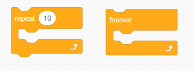
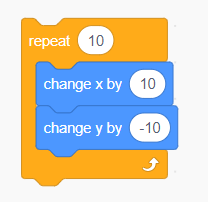
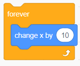
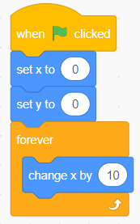

This is part 3 of the Scratch Tutorial For Complete Beginners. In this scratch tutorial we will learn about loops and see how they work in code and in our game

## What are loops?

In [the previous chapter](https://thinkcodeplay.com/scratch-variables-and-coordinates/) we learned about the direction that code goes. We learned that code get executed one after the other going from the top code to the bottom. Once we reach the bottom, the code finishes to run.

A loop basically says that instead of going all the way to the bottom we can tell the code to start over again from a starting point.

## Types of loops

Here are two basic types of loop block we can use

A repeat block and a forever block. Let's try them out by changing the x or y of out character.

Try out this example:

Click on the repeat block to run it. As you can see if the character start at point (X:0,Y:0) it will now move to (X:100,Y:-100).

So what happened here?

The first instruction **change x by 10** got executed, then **change y by -10** was used, moving our character to (X:10,Y:-10). Now, instead of finishing to run the code, we moved back to the beginning of the loop and ran the instructions **change x by 10** and **change y by -10**, nine more times moving us to (X:100,Y:-100). This happened because of the repeat 10 block.

So when we use a loop block, we are saying to all the inner code blocks to run again once the reach the bottom. Then we run the inner part again until to loop block says we can finish, in our case the condition to finish the loop was after running 10 times.

Now try doing the same with the other loop.

Now the character will move all the way to the right side of the screen. You can event try to move the character somewhere else on the screen and it will still continue moving to the right.

This is because this loop will run forever. There is no exit condition to stop it from running. In the previous example the exit condition was to run 10 times and after that it will stop. Here we don't have any conditions. We need to manually stop the loop.

Above the game area you will find the Go and Stop buttons. Press the stop button to stop the loop.

This leads us to a concept in game development called the game loop.

## Go and stop

When running a game we want to always have the game start at a specific point. That is why we need the stop and go buttons. The Go button tells the game to start running it's instructions.

But how does the game know what instructions to run?

For this we can use the **When go clicked block**:

This will tell the character to start running the next instructions when the go button is clicked.

When we use this with the together with the forever loop we can be sure that every time we start the game, it will return to the same state that we want the game to start from.

Create the next code block:

Now we can press the go button to start the character from (X:0,Y:0) and it will move to the right border. Now even if the character moves to another place on the screen we can be sure that will start from (X:0,Y:0) the next time we run the code with the go button.

## Summery

In this tutorial we learned that loops are a way to repeat code over and over. Sometimes we have conditions to make the loop stop after the condition is met such as after running 10 times, and sometimes we want the loop to run forever.

We also learned that we can use the go and stop buttons to make the game start from a beginning state and stop the game from running if it is stuck in an endless loop.

Hope you enjoyed this one, please leave a comment if you did!
